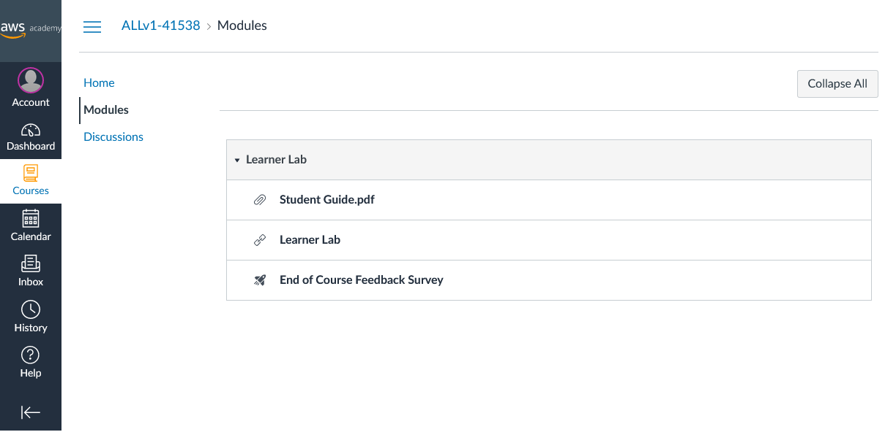

# Einstieg in das AWS Academy Learner Lab

1. Folgen Sie in Moodle dem Link [AWS Academy Learner Lab](https://awsacademy.instructure.com/). Falls die Kursübersicht angezeigt wird, wählen Sie den Kurs **AWS Academy Learner Lab**.
1. Wechseln Sie in die Modulansicht mittels **Modules**. 
1. Öffnen Sie das **Learner Lab** durch Anklicken.
1. Bestätigen Sie die Nutzungsbedingungen durch Klick auf **I agree**.  
1. Starten Sie das Lab durch Klick auf den Button **Start Lab**. Das Starten kann mehrere Minuten brauchen. 
1. Nach dem erfolgreichen Start kann die AWS Management Console durch Klick auf den Link AWS neben dem grünen Punkt geöffnet werden.

Das Learner Lab läuft vier Stunden und wird danach automatisch beendet. Beim Beenden werden die EC2-Instanzen gestoppt.

Die Laufzeit kann durch einen weiteren Klick auf **Start Lab** um vier Stunden verlängert werden.

Im Learner Lab steht ein Guthaben von 50$ für dieses Semester zur Verfügung. Sie sehen in der Kopfleiste, wie viel davon schon verbraucht ist.
